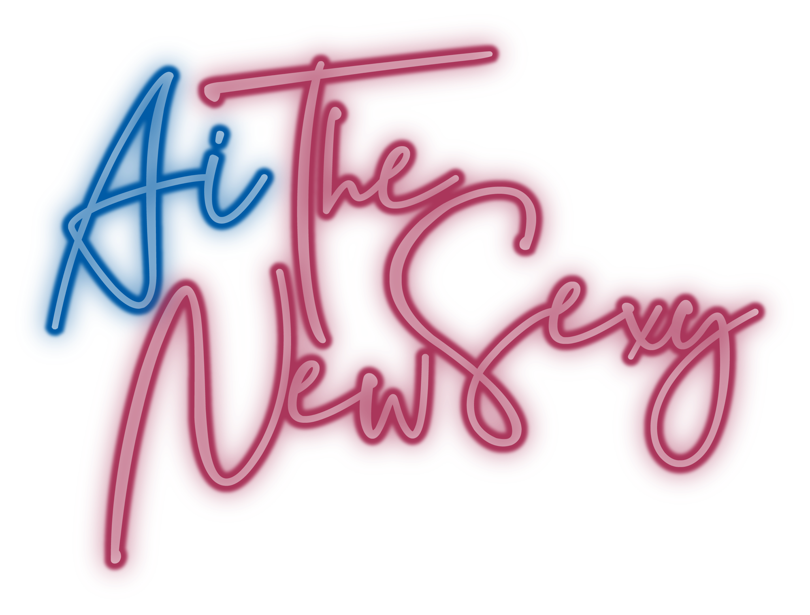

# AI · The New Sexy

> A single-file landing page that materializes the manifesto behind a hand-painted neon logo. Dark, kinetic, cursor-reactive. Built in one file with vanilla HTML + CSS + GSAP.

```
~/Projects/ai-the-new-sexy/
├── index.html          # 663 lines · everything lives here
├── assets/
│   └── logo.png        # the hand-lettered neon mark with alpha channel
└── README.md           # this document
```

---

## Concept

The brief: turn a logo (`Ai · The New Sexy`, hot-pink + electric-blue handwritten neon, transparent PNG) into a site that *feels* like its own claim. Not a deck about the brand. The brand, performed.

The site is one continuous gesture across six chapters:

1. **Boot** — terminal typewriter sequence pretending to "initialize" the aesthetic engine.
2. **Hero** — the logo, alive: breathing glow, cursor-reactive liquid distortion, displaced by a fractal noise field tied to the pointer.
3. **Manifesto** — pinned scroll, eight lines of kinetic typography revealed line by line, with two words scrambling in mid-stanza.
4. **Pillars** — three glass cards (Form / Intent / Friction) with 3D parallax tilt and progressive SVG line drawing.
5. **Marquee** — infinite scrolling display, gradient + outline + filled variants, accelerated by scroll velocity.
6. **CTA + Footer** — invocation, glitch-fill button, magnetic hover.

Single HTML file. No bundler. No framework. CDN GSAP. Loads on a phone over LTE.

---

## Stack

| Layer        | Choice                                                           |
|--------------|------------------------------------------------------------------|
| Markup       | Plain HTML5                                                      |
| Styling      | One inline `<style>` block · custom properties · backdrop-filter |
| Animation    | GSAP 3.12.5 + ScrollTrigger + ScrollToPlugin + CustomEase        |
| Type effects | Manual line-split + custom scramble fn (no plugin)               |
| Ambient FX   | Canvas 2D flow field · SVG `feTurbulence` + `feDisplacementMap`  |
| Fonts        | Fraunces (display italic) · Space Grotesk (UI) · JetBrains Mono  |
| Build        | None. Open `index.html` in a browser.                            |

> **Why no ScrambleTextPlugin?** It is part of GSAP "Club" / bonus plugins. As of 2026-04-30 it is **not** mirrored on the public jsDelivr CDN at `gsap@3.12.5/dist/`. Loading it returns 404 and breaks `gsap.registerPlugin(...)` if you reference it. We replaced it with a 14-line custom scramble function.

---

## Architecture

### File anatomy (`index.html`)

```
1   ─ <head>         meta + Google Fonts preconnect
6   ─ <style>        ~280 lines · all visual layers
275 ─ <body>
277 ─   ambient layers       canvas#flow, vignette, scanlines, grain
283 ─   custom cursor        ring + dot
286 ─   #boot                terminal typewriter overlay
299 ─   nav                  fixed top, mix-blend-mode: difference
311 ─   .hero                logo stage + headline + scroll cue
333 ─   .manifesto           pinned section, 8 kinetic lines
348 ─   .section#pillars     3-card grid with SVG vis
404 ─   .marquee             infinite track, velocity-aware
418 ─   .section#drops       5 case-study cards
448 ─   .cta                 invocation, fill button
458 ─   footer               minimal meta strip
465 ─   <script src=GSAP>    CDN
470 ─   <script>             ~250 lines of orchestration
```

### Layer stack (z-index)

```
[200] boot overlay              (auto-removes after sequence)
[ 90] custom cursor (ring+dot)
[ 80] nav
[ 60] grain (svg fractalNoise, mix-blend-mode: overlay)
[ 55] scanlines (repeating-linear-gradient, mix-blend-mode: overlay)
[ 50] vignette (radial, edge dim)
[  5] page content
[  0] flow field canvas (mix-blend-mode: screen, opacity .55)
```

### Color system

```css
--void:    #000;
--bg:      #040104;
--ink:     #f5e6d3;     /* warm cream, body text */
--mute:    #7a6878;     /* secondary text */
--magenta: #ff1f71;     /* primary accent, the "sexy" */
--hot:     #ff4d8f;     /* secondary pink */
--rose:    #ffb7c5;     /* meta, monospace labels */
--blue:    #1e5fff;     /* the "Ai" blue */
--cyan:    #00e5ff;     /* highlight + scramble color */
--indigo:  #4338ca;     /* unused fallback */
```

Ratio: 70 % void, 22 % cream, 8 % accent. Restraint is the multiplier.

---

## Effects catalog

Every visible technique, what it is, where it lives, how it works.

### 01 · The "live" logo

The PNG has a transparent background. We never edit the bitmap; we **layer four FX on top of it** to make a static raster feel hand-painted and breathing.

```html
<div class="logo-stage" id="stage">
  <svg class="distort">
    <filter id="liquid" x="-20%" y="-20%" width="140%" height="140%">
      <feTurbulence id="turb" type="fractalNoise" baseFrequency="0.012 0.018" seed="3"/>
      <feDisplacementMap id="disp" in="SourceGraphic" scale="6"/>
    </filter>
  </svg>
  
</div>
```

**Layer A — `drop-shadow` (twice).** Unlike `box-shadow`, `drop-shadow` honors the alpha channel of the source. The neon halo follows the *strokes*, not the bounding rectangle. Two stacked drop-shadows give a near halo (magenta, tight) and a far halo (blue, diffuse) → real neon.

**Layer B — radial glows on a `::before` pseudo-element.**
```css
.logo-stage::before{
  content:""; position:absolute; inset:-8%;
  background:
    radial-gradient(ellipse at 30% 50%, rgba(30,95,255,.4)  0%, transparent 50%),
    radial-gradient(ellipse at 65% 60%, rgba(255,31,113,.45) 0%, transparent 55%);
  filter: blur(60px);
  animation: breathe 6s ease-in-out infinite alternate;
  z-index:-1;
}
```
Two large blurred ellipses sitting *behind* the logo, positioned roughly where "Ai" (left) and "TheNewSexy" (center-right) live. `blur(60px)` makes them volumetric. `breathe` scales them between 0.95 → 1.05 — the stage looks like it's inhaling.

**Layer C — SVG liquid filter.** Defined inline. The `<svg class="distort">` wrapper is `width:0; height:0` so the filter is *defined* but not *painted*. We reference it via `filter: url(#liquid)` from the ``. SVG filters operate on the rasterized output of the element, so they happily distort raster `` content.

The filter chain:
1. `feTurbulence` → procedural fractal noise.
2. `feDisplacementMap` → uses that noise as a displacement field. Each pixel of the source is offset by the noise value at that pixel, scaled by `scale`.

**Layer D — JS lerp.** Pointer position drives the filter parameters every frame:

```js
let rx=0,ry=0,tx=0,ty=0,seed=0;
addEventListener("pointermove", e=>{
  const r = stage.getBoundingClientRect();
  rx = (e.clientX - (r.left+r.width/2)) / r.width;
  ry = (e.clientY - (r.top +r.height/2)) / r.height;
});
function tick(){
  tx += (rx-tx)*.08;  ty += (ry-ty)*.08;     // smooth lerp toward target
  seed += .35;
  const dist = Math.min(1, Math.hypot(tx,ty));
  turb.setAttribute("baseFrequency", `${(.008 + Math.abs(tx)*.025).toFixed(4)} ${(.012 + Math.abs(ty)*.025).toFixed(4)}`);
  turb.setAttribute("seed", (seed|0).toString());
  disp.setAttribute("scale", (4 + dist*22).toFixed(1));
  requestAnimationFrame(tick);
}
```

Three things change per frame:
- **`baseFrequency`** — how dense the noise is. Cursor X/Y bias the X/Y frequency.
- **`seed`** — re-rolls the noise pattern. Without this the displacement is static; with it the lettering "shimmers" like wet ink.
- **`scale`** — strength of the displacement. Distance from center → bigger warp.

Result: the logo looks alive. Cursor near center → calm. Cursor at corners → the strokes liquefy.

Disabled when `prefers-reduced-motion: reduce`.

---

### 02 · Custom cursor (ring + dot)

```html
<div class="cursor-ring"></div>
<div class="cursor-dot"></div>
```

```css
.cursor-ring,.cursor-dot{
  position:fixed; pointer-events:none; z-index:90;
  border-radius:50%; mix-blend-mode:difference;
  will-change:transform;
}
.cursor-ring{ width:42px; height:42px; border:1px solid var(--ink) }
.cursor-dot { width:5px;  height:5px;  background:var(--ink) }
.is-hover .cursor-ring{ width:80px; height:80px; background:rgba(255,31,113,.18); border-color:var(--magenta) }
```

**JS — two trackers, two lerps.**
```js
let rx=ix, ry=iy, dx=ix, dy=iy, mx=ix, my=iy;
addEventListener("pointermove", e=>{ mx=e.clientX; my=e.clientY });
(function loop(){
  rx += (mx-rx)*.18;  ry += (my-ry)*.18;     // ring is slow
  dx += (mx-dx)*.55;  dy += (my-dy)*.55;     // dot is snappy
  ring.style.transform = `translate(${rx}px,${ry}px) translate(-50%,-50%)`;
  dot.style.transform  = `translate(${dx}px,${dy}px) translate(-50%,-50%)`;
  requestAnimationFrame(loop);
})();
```

`mix-blend-mode: difference` inverts whatever's behind it, so the cursor stays legible on every background without needing color logic.

`is-hover` class is added to `<body>` on `pointerenter` of any `a, button, [data-mag], .pillar, .drop`, expanding the ring 42 → 80 px and tinting it magenta.

Disabled on touch / `< 900px` viewports (`cursor:auto` and ring/dot `display:none`).

---

### 03 · Magnetic links

```js
document.querySelectorAll("[data-mag]").forEach(el=>{
  const strength = 0.35;
  el.addEventListener("pointermove", e=>{
    const r = el.getBoundingClientRect();
    const x = e.clientX - (r.left + r.width/2);
    const y = e.clientY - (r.top  + r.height/2);
    gsap.to(el, {x:x*strength, y:y*strength, duration:.6, ease:"power3.out"});
  });
  el.addEventListener("pointerleave", ()=> gsap.to(el,{x:0,y:0,duration:.7,ease:"elastic.out(1,.4)"}));
});
```

Add `data-mag` to any element. Pointer-relative offset × 0.35 → element drifts toward the cursor with a smooth ease, snaps back with elastic on leave. Used on nav links, CTA, drops, the "to top" anchor.

---

### 04 · Boot sequence

The entire page is hidden behind a full-screen `<div class="boot">` with six terminal rows. Each row starts at `opacity:0`, GSAP fades them in 0.18s apart.

```js
const tl = gsap.timeline({onComplete:()=>{
  gsap.to(overlay,{autoAlpha:0,duration:.7,ease:"expo",onComplete:()=>overlay.remove()});
  heroIn();
}});
rows.forEach((r,i)=> tl.to(r,{opacity:1,y:0,duration:.18}, i*.18));
tl.to({},{duration:.6}); // hold
```

**Defensive layer.** If GSAP fails to load, the boot would stay forever. We added a CSS keyframe fallback:

```css
.boot{ animation: bootSafety 6s forwards }
@keyframes bootSafety{
  0%, 90%   { opacity:1; visibility:visible }
  100%      { opacity:0; visibility:hidden; pointer-events:none }
}
```

Plus an early JS guard:
```js
if(typeof gsap === "undefined"){ document.getElementById("boot")?.remove(); throw new Error("gsap failed to load"); }
```

So three levels of resilience: (1) gsap loaded → JS fade. (2) gsap missing → JS guard removes overlay. (3) total JS failure → CSS animation forces it gone at 6s.

---

### 05 · Hero entrance

```js
const tl = gsap.timeline({defaults:{ease:"expo"}});
tl.from(".nav",         {y:-20, autoAlpha:0, duration:.8})
  .from(".hero-tag",    {autoAlpha:0, y:20, duration:.7}, "-=.5")
  .from("#stage",       {autoAlpha:0, scale:.92, duration:1.3, ease:"silk"}, "-=.4")
  .from("#heroTitle .word > span", {yPercent:120, stagger:.06, duration:1, ease:"silk"}, "-=.7")
  .from(".hero-bottom", {autoAlpha:0, y:10, duration:.6}, "-=.4");
```

The headline is split manually:
```html
<h1 class="hero-title">
  <span class="word"><span>An</span></span>
  <span class="word"><span>aesthetic</span></span>
  <span class="word"><span>engineered</span></span>
  ...
</h1>
```
Outer `.word` is `display:inline-block; overflow:hidden;`. Inner `<span>` is what we animate (`yPercent:120 → 0`). Result: each word appears to slide up from underneath a horizontal mask, like a flipboard.

`CustomEase` curves used:
- `silk` = `M0,0 C0.2,0.8 0.2,1 1,1` — fast in, long quiet out.
- `expo` = `M0,0 C0.16,1 0.3,1 1,1` — explosive at start, glides to rest.

---

### 06 · Logo parallax on scroll

```js
gsap.to("#stage", {
  yPercent: -25, scale: .82, filter:"blur(6px)", ease:"none",
  scrollTrigger:{ trigger:"#hero", start:"top top", end:"bottom top", scrub:.6 }
});
gsap.to("#heroTitle",{
  yPercent:-80, autoAlpha:0,
  scrollTrigger:{ trigger:"#hero", start:"top top", end:"bottom top", scrub:.4 }
});
```

`scrub:.6` = the timeline's progress is tied to the scroll progress, smoothed by 0.6s of inertia. The logo drifts up + shrinks + blurs as the hero leaves; the headline fades faster (scrub `.4`).

---

### 07 · Manifesto · pinned kinetic typography

```js
const lines = gsap.utils.toArray("#mLines .line");
const tl = gsap.timeline({
  scrollTrigger:{
    trigger:"#manifesto", start:"top top", end:`+=${lines.length*240}`,
    pin:true, scrub:.6,
    onUpdate(self){
      const idx = Math.floor(self.progress * (lines.length+1));
      lines.forEach((l,i)=> l.classList.toggle("is-active", i<idx));
    }
  }
});
lines.forEach((l,i)=>{
  tl.fromTo(l,
    { yPercent:120, autoAlpha:0 },
    { yPercent:0,   autoAlpha:1, duration:1, ease:"silk" },
    i * .8
  );
});
```

Three things at once:
1. **Pin** — `#manifesto` sticks to the viewport for `lines.length × 240 px` of scroll.
2. **Scrub timeline** — each line fromTo is placed at `i*0.8` on the timeline; the timeline's playhead is tied to scroll progress.
3. **Active class** — `onUpdate` toggles `.is-active` on lines whose index ≤ current progress, transitioning their color from `--mute` → `--ink` over 0.6s.

**Risograph misregister on selected lines.** Two lines have class `.miss`:
```css
.line.miss::before,.line.miss::after{
  content: attr(data-text);
  position:absolute; left:0; top:0;
  color:transparent; mix-blend-mode:screen; pointer-events:none;
}
.line.miss::before{ color:var(--magenta); transform:translate(-2px,1px); opacity:.45 }
.line.miss::after { color:var(--cyan);    transform:translate( 2px,-1px); opacity:.45 }
```
The text is duplicated three times via `::before`/`::after` reading from `data-text`. Slight offsets in opposite directions → CMYK chromatic-print misregister effect.

**Custom scramble.** Two words inside the manifesto (`utilitarian`, `meaning`) have class `.scram` with a `data-final="..."` attribute. When the line scrolls into view we run:

```js
function scrambleTo(el, finalText, duration=1.4){
  const chars = "01!?#%&*<>/+-ABCDEFGHJKLMNPQRSTUVWXYZ";
  const len = finalText.length;
  const start = performance.now();
  function tick(now){
    const t = Math.min(1, (now - start) / (duration*1000));
    const reveal = Math.floor(t * len * 1.2);
    let out = "";
    for(let i=0; i<len; i++){
      out += i < reveal ? finalText[i] : chars[(Math.random()*chars.length)|0];
    }
    el.textContent = out;
    if(t < 1) requestAnimationFrame(tick);
    else el.textContent = finalText;
  }
  requestAnimationFrame(tick);
}
```

Reveal cursor moves from left to right at 1.2× the duration; characters before the cursor are locked, after still scrambled. 14 lines, no plugin needed.

---

### 08 · Pillars · 3D tilt + progressive line drawing

**Tilt.**
```js
p.addEventListener("pointermove", e=>{
  const r = p.getBoundingClientRect();
  const x = (e.clientX - r.left)/r.width  - .5;
  const y = (e.clientY - r.top )/r.height - .5;
  gsap.to(p, {
    rotateX:-y*6, rotateY:x*6,
    transformPerspective:800,
    duration:.5, ease:"power2.out"
  });
});
p.addEventListener("pointerleave", ()=> gsap.to(p,{rotateX:0,rotateY:0,duration:.8,ease:"elastic.out(1,.5)"}));
```

`rotateX/Y` ± 6° relative to pointer position. `perspective: 800` gives the 3D depth. Elastic snap-back on leave.

**SVG line drawing without DrawSVGPlugin.** GSAP's DrawSVGPlugin is also Club-only on the public CDN, so we use the standard CSS technique:

```js
gsap.utils.toArray(".p-line").forEach((path,i)=>{
  const len = path.getTotalLength();
  gsap.set(path,{ strokeDasharray:len, strokeDashoffset:len });
  gsap.to(path,{ strokeDashoffset:0, duration:1.6, ease:"silk", delay:i*.15,
    scrollTrigger:{ trigger:path.closest(".pillar"), start:"top 80%" }
  });
});
```

`strokeDasharray:len; strokeDashoffset:len` makes the path invisible (one dash, fully offset). Animating offset to 0 reveals the path stroke from start to end. Three stacked paths, staggered by 0.15s, give a multi-color drawing.

The orbit graphic in pillar 2 just spins continuously:
```js
gsap.to(".p-orbit", {rotation:360, duration:24, ease:"none", repeat:-1, transformOrigin:"100px 70px"});
```

---

### 09 · Marquee · velocity-aware infinite scroll

```js
const track = document.getElementById("mTrack");
const w = track.scrollWidth/2;
gsap.to(track,{
  x:-w, duration:30, ease:"none", repeat:-1,
  modifiers:{ x: gsap.utils.unitize(v => parseFloat(v) % -w) }
});
ScrollTrigger.create({
  onUpdate(self){
    const v = self.getVelocity();
    gsap.to(track,{ timeScale: 1 + Math.min(Math.abs(v)/2000, 4) * Math.sign(v||1), duration:.4 });
  }
});
```

Two pieces:
1. **Wrap with modifier** — instead of resetting the position, we modulo the `x` value by `-w`, which gives a seamless infinite loop with no jump.
2. **Velocity hookup** — a global `ScrollTrigger.create({onUpdate})` reads scroll velocity each tick. Faster scroll → higher `timeScale` (up to 5×). Direction also matters (`Math.sign(v)`), so the marquee briefly reverses if you scroll up fast.

---

### 10 · Drops grid · asymmetric reveal + per-card vis

```css
.drops{ display:grid; grid-template-columns:repeat(12,1fr); gap:18px }
.drop:nth-child(1){ grid-column:span 5; aspect-ratio:5/3 }
.drop:nth-child(2){ grid-column:span 7; aspect-ratio:7/3 }
.drop:nth-child(3),
.drop:nth-child(4),
.drop:nth-child(5){ grid-column:span 4; aspect-ratio:4/3 }
```

5-card layout in a 12-column grid. Row 1: 5+7. Row 2: 4+4+4. Asymmetric, editorial. Each card reveals on scroll with a stagger keyed to its column position.

Every card has its own SVG visual at `.drop-vis` (`opacity:.55`, `mix-blend-mode:screen`, sitting behind the title):

| # | Card                  | Visual                                                                        |
|---|-----------------------|-------------------------------------------------------------------------------|
| 01| Halftone *breath*     | Two open circles, magenta + blue, intersecting — static SVG                   |
| 02| Wave / *counterwave*  | Two opposing sine paths (`Q`-bezier), pink + cyan, mirror about the midline   |
| 03| Letters that *flicker*| 15 monospace glyphs scattered across the card, each independently flickering at random opacity + cadence |
| 04| Polygon *desire*      | Three nested pentagons rotating in alternating directions, breathing scale    |
| 05| Negative *seduction*  | Radial-gradient hole (black core, magenta halo) with three rings pulsing outward, staggered |

**Flicker animation** (`.fk` glyphs):
```js
gsap.utils.toArray(".flicker-grid .fk").forEach(t=>{
  gsap.set(t,{opacity:.15});
  gsap.to(t,{
    opacity: gsap.utils.random(.4, 1),
    duration: gsap.utils.random(.08, .3),
    repeat:-1, yoyo:true, repeatRefresh:true,
    ease:"steps(1)",
    delay: gsap.utils.random(0, 1.5)
  });
});
```
`repeatRefresh:true` re-rolls the random values *every cycle*, so each glyph never settles into a rhythm. `ease:"steps(1)"` makes the change instantaneous — proper terminal flicker, not soft fade.

**Polygon stack**:
```js
gsap.to(".poly-stack .poly-a", {rotation: 360, duration:38, ease:"none", repeat:-1, transformOrigin:"center"});
gsap.to(".poly-stack .poly-b", {rotation:-360, duration:28, ease:"none", repeat:-1, transformOrigin:"center"});
gsap.to(".poly-stack .poly-c", {rotation: 360, duration:18, ease:"none", repeat:-1, transformOrigin:"center"});
gsap.utils.toArray(".poly-stack .poly").forEach((p,i)=>{
  gsap.to(p,{ scale:1.04, duration:2.6+i*.4, ease:"sine.inOut", yoyo:true, repeat:-1, transformOrigin:"center" });
});
```
Different rotation speeds + opposite signs → never aligns the same way twice. Independent breathing scale on each layer adds a third frequency.

**Void rings**:
```js
gsap.utils.toArray(".void-vis .void-ring").forEach((r,i)=>{
  gsap.fromTo(r,
    { scale:.6, opacity:.7, transformOrigin:"200px 120px" },
    { scale:1.25, opacity:0, duration:3.2, ease:"power1.out", repeat:-1, delay:i*1.06 }
  );
});
```
Three rings, each starts small + opaque, expands to 1.25× while fading to 0. Stagger of 1.06 s ≈ duration / 3, so a new pulse begins as the previous one is fading — continuous breathing aperture.

---

### 11 · CTA fill button

```css
.cta-btn{ position:relative; overflow:hidden; transition:color .4s }
.cta-btn::before{
  content:""; position:absolute; inset:0;
  background:var(--magenta);
  transform:translateY(101%);
  transition:transform .5s cubic-bezier(.2,.8,.2,1);
  z-index:-1;
}
.cta-btn:hover::before{ transform:translateY(0) }
.cta-btn:hover{ color:var(--void) }
```

The pseudo-element starts below the button (`translateY(101%)`); on hover it slides up to fill, and the text color flips to void. Pure CSS, no JS.

---

### 12 · Ambient layers

**Canvas flow field.**
```js
const N = 90;
for(let i=0;i<N;i++) parts.push({
  x:Math.random()*w, y:Math.random()*h,
  vx:0, vy:0, life:Math.random()*200, hue: Math.random()<.5 ? 330 : 215
});

function noise(nx,ny){
  return Math.sin(nx*0.0028 + t*0.0007) + Math.cos(ny*0.0024 - t*0.0006);
}

(function draw(){
  t++;
  x.fillStyle = "rgba(0,0,0,.06)"; x.fillRect(0,0,w,h);  // motion-blur trail
  for(const p of parts){
    const ang = noise(p.x,p.y) * Math.PI * 2 + (mx-.5)*.6;
    p.vx += Math.cos(ang)*.05;
    p.vy += Math.sin(ang)*.05;
    p.vx *= .94; p.vy *= .94;
    p.x += p.vx; p.y += p.vy;
    p.life--;
    if(p.life<=0 || off-screen){ respawn(p); }
    x.fillStyle = `hsla(${p.hue},90%,60%,.55)`;
    x.fillRect(p.x, p.y, 1.2, 1.2);
  }
  requestAnimationFrame(draw);
})();
```

90 particles, each in a 2D field defined by `sin(x*k1 + t*k2) + cos(y*k3 - t*k4)`. Pointer X biases the field angle by ±0.6 rad. Particles trail because we paint `rgba(0,0,0,.06)` over the canvas each frame instead of clearing it. Two hue families: 330 (magenta) and 215 (blue), 50/50.

`mix-blend-mode: screen` on the canvas → particles only brighten the void, never darken anything else.

**Grain.** SVG `feTurbulence` rendered as a data URI, repeated, 0.08 opacity, `mix-blend-mode: overlay`. ~1 KB inline, no extra request.

**Scanlines.** `repeating-linear-gradient(0deg, transparent 2px, white 1px)`, 0.06 opacity, `mix-blend-mode: overlay`.

**Vignette.** `radial-gradient(ellipse at center, transparent 30%, rgba(0,0,0,.65) 100%)` — pulls the eye to center.

---

## Performance

| Concern         | Mitigation                                                    |
|-----------------|---------------------------------------------------------------|
| Cursor tracking | `requestAnimationFrame` lerp, never bind heavy work to mousemove |
| SVG filter cost | One filter on one image; `feTurbulence` re-evaluated per frame is the heaviest cost — disabled on `prefers-reduced-motion` |
| Canvas         | 90 particles, single fillRect per particle, fade-trail instead of full clear |
| Reflow         | All animated transforms; `will-change: transform` on cursor + marquee |
| ScrollTrigger  | One pinned section, scrub-tied; velocity reader is a single global tick |
| Mobile         | Custom cursor disabled at `<900px`; tilt/liquid skipped under reduced-motion |

The page is ~37 KB of HTML + ~2.3 MB of PNG (the logo). Everything else is CDN-cached.

---

## Run locally

```bash
git clone <this-repo>
cd ai-the-new-sexy
open index.html
```

That's it. No `npm install`, no build, no server. Works from `file://`.

If you want a localhost (some browsers throttle `file://`):
```bash
python3 -m http.server 4173
# open http://localhost:4173
```

---

## Browser support

Tested:
- macOS Safari 17 ✓
- Chrome / Edge 120+ ✓
- Firefox 120+ ✓ (SVG filter slightly less smooth)
- iOS Safari 17 ✓ (custom cursor auto-disabled)

Required features: CSS custom properties · `backdrop-filter` · SVG `feTurbulence` + `feDisplacementMap` · `mix-blend-mode` · `requestAnimationFrame` · `IntersectionObserver` (via ScrollTrigger).

---

## Accessibility

- `prefers-reduced-motion: reduce` disables liquid distortion + tilt + cursor lerp.
- All interactive elements are keyboard-focusable (`<a>`, `<button>`).
- Color contrast on body text (cream on void) ≈ 14:1.
- Custom cursor falls back to `auto` on touch devices.
- Every section has semantic markup (`<section>`, `<article>`, `<h1>`–`<h4>`).

---

## Credits

- **GSAP** — Greensock Animation Platform (free since Webflow acquisition, April 2024).
- **Fonts** — [Fraunces](https://fonts.google.com/specimen/Fraunces), [Space Grotesk](https://fonts.google.com/specimen/Space+Grotesk), [JetBrains Mono](https://fonts.google.com/specimen/JetBrains+Mono).
- **Logo** — `Ai · The New Sexy`, hand-lettered neon, brought into the page as a transparent PNG.

---

## License

All rights reserved on the logo and brand. The code patterns in this file are released under MIT — copy what you like.
